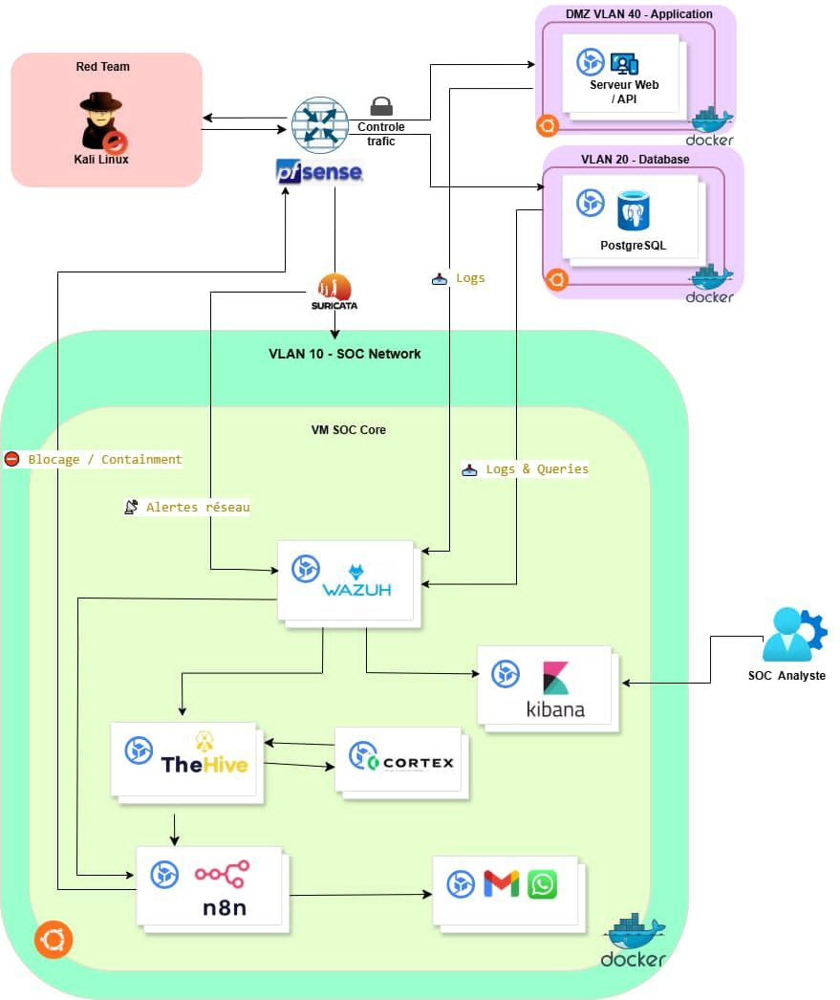
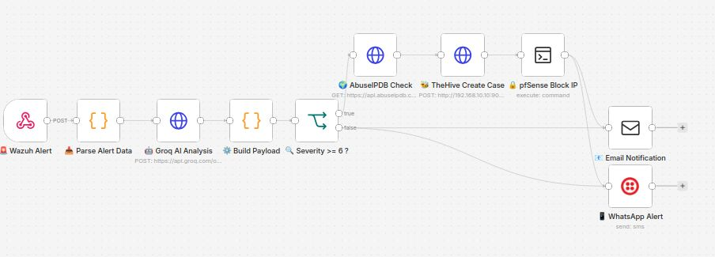
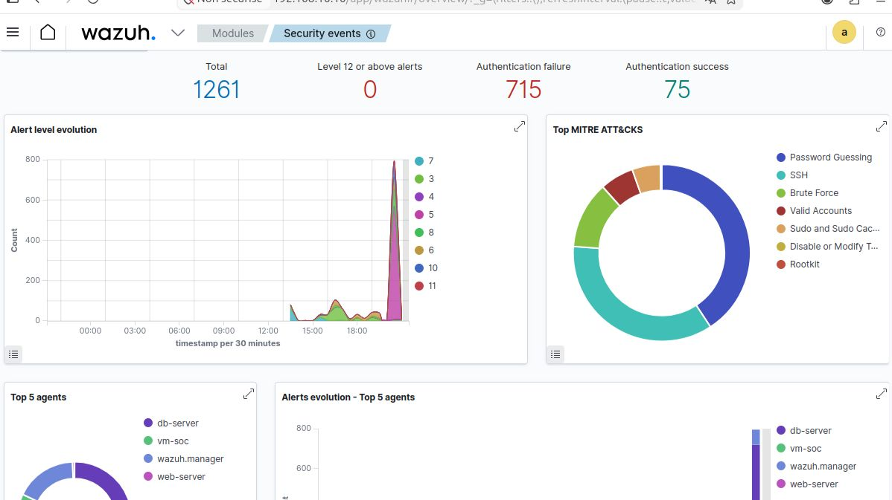
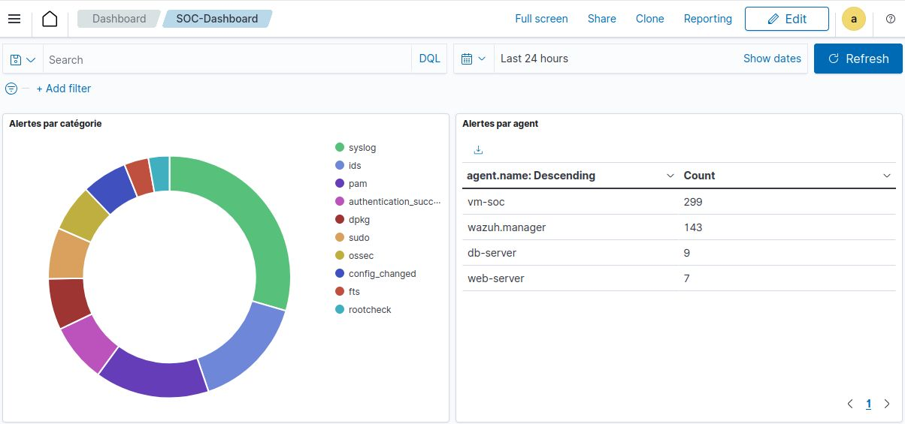
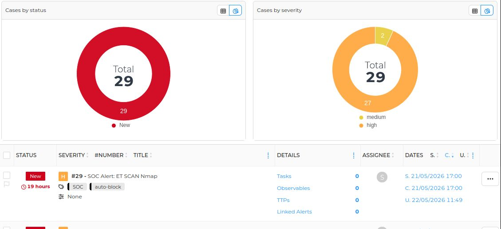

# AutoSoc

Design and deployment of a Security Operations Center integrating detection, monitoring, automation, and incident response, built as a virtualized environment under VMware and tested through a Red Team versus Blue Team setup.

## Overview

This lab reproduces a realistic enterprise SOC pipeline from scratch. Traffic passes through a segmented network, gets inspected for intrusions, lands in a centralized SIEM, and any alert that crosses a severity threshold is automatically enriched, turned into a case, and pushed out as a notification. Every component below was configured and tested inside this environment, and the numbers in the Results section come directly from the deployed dashboards.

## Architecture

Four VLANs sit behind a pfSense firewall: SOC, DMZ, Database, and WAN. A Kali Linux machine plays the Red Team role and sends traffic through pfSense, which enforces traffic control before anything reaches the protected zones. Suricata inspects that traffic inline on the SOC VLAN. Inside the SOC core, Wazuh collects alerts and logs, TheHive turns qualifying alerts into cases, Cortex enriches those cases with threat intelligence, and n8n orchestrates the full path from detection to notification.




## Tools Deployed

| Tool | Role |
|---|---|
| pfSense | Firewall and router, enforcing 4 VLANs: SOC, DMZ, DB, and WAN |
| Suricata | Network intrusion detection, inline on the SOC VLAN |
| Wazuh | Centralized SIEM, agents on web-server, db-server, and vm-soc |
| OpenSearch Dashboards | Visualization and analysis of collected security events |
| TheHive | Incident management, cases created automatically from Wazuh alerts |
| Cortex | Alert enrichment, queries threat intelligence sources such as AbuseIPDB |
| n8n | Workflow automation, orchestrates the alert to notification pipeline |
| Groq AI (Llama 3) | Automated first pass analysis of incoming alerts |
| Docker | Containerized the SOC services running inside the SOC core VM |

## Attack Scenarios

- **Nmap scan** against the network, caught by Suricata, with an incident created automatically in TheHive
- **SSH brute force** using Hydra, resulting in a successful compromise and an automatically generated incident
- **Multi-layer scan detection** covering both PostgreSQL and Oracle targets

## Automation Pipeline

```
Kali Linux → Suricata detects the activity → Wazuh generates an alert
    → TheHive automatically creates an incident
    → Cortex enriches the alert via AbuseIPDB
    → n8n orchestrates the workflow, Groq AI (Llama 3) analyzes the incident
    → Real-time Email and WhatsApp notifications are sent
```




## Results

| Metric | Value |
|---|---|
| Total alerts detected | 1,261 |
| Authentication failures analyzed | 715 |
| Authentication successes logged | 75 |
| Incidents auto-created in TheHive | 29 |
| Notification channels | Email, WhatsApp |


*Alert level evolution and top MITRE ATT&CK techniques detected.*


*Alerts grouped by category and by agent.*



*Status and severity distribution across the 29 incidents created.*


## Skills Developed

- Network intrusion detection and signature-based alerting
- Security incident management and case handling
- SOC workflow automation with n8n
- Integration of artificial intelligence into cybersecurity operations
- Network segmentation and firewall policy design with pfSense
- SIEM configuration and dashboard building with Wazuh and OpenSearch


## finally

The pipeline held up under simulated attack traffic, from a simple network scan through to a successful brute force compromise, with 1,261 alerts processed and 29 incidents created automatically end to end.

---
Internship project, GTBank Uganda Limited.
